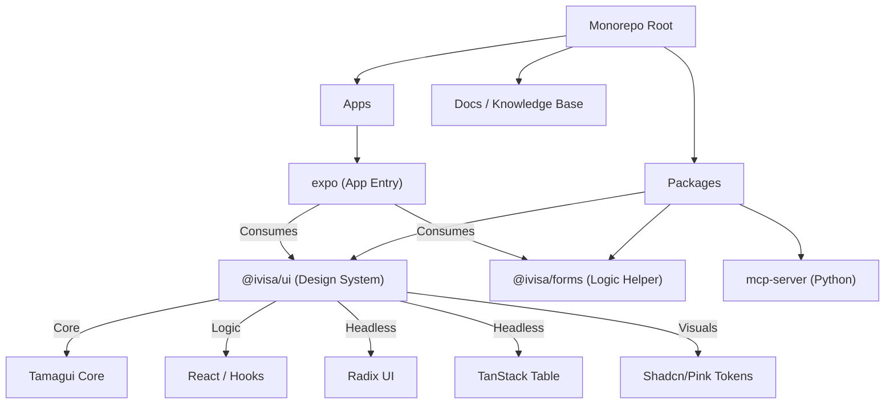

# SYSTEM KNOWLEDGE GRAPH

> **VERSION**: 1.0.0
> **LAST UPDATED**: by Jules (System Architect)
> **STATUS**: ACTIVE / SOURCE OF TRUTH
> **SCOPE**: Entire Repository

---

## 1. HIGH-LEVEL ARCHITECTURE

### 1.1 Topography (Mermaid)

### 1.2 The "Frankenstein Controlado" Strategy
The architecture explicitly forbids direct porting of Shadcn components. Instead, it employs a composition strategy:
*   **Core**: `tamagui` (Layout, Optimization, Core Components).
*   **Logic**: Headless libraries for complex behavior (TanStack Table, React Hook Form, Radix UI Primitives).
*   **Layout**: "Bento" methodology for responsive, grid-like layouts.
*   **Styling**: Custom Theme Tokens (Shadcn/Pink) mapped to Tamagui's styling engine.

---

## 2. ENTITY-RELATIONSHIP MODEL (Atomic Design)

The system strictly follows Atomic Design principles within `@ivisa/ui`.

| Layer | Responsibility | Dependencies | Location |
| :--- | :--- | :--- | :--- |
| **Atoms** | Indivisible UI elements. Pure styling, minimal logic. | Tokens, Tamagui Core | `packages/ui/src/atoms` |
| **Molecules** | Simple groups of atoms functioning together. | Atoms, 3rd Party Libs | `packages/ui/src/molecules` |
| **Organisms** | Complex, business-aware components. | Molecules, Atoms, Complex Logic | `packages/ui/src/organisms` |
| **Templates** | Page-level structures (Layouts). | Organisms | `packages/ui/src/organisms` (Layouts) |
| **Pages** | (Screens) Route handlers and data fetching. | Organisms, Templates | `apps/expo/src/screens` |

---

## 3. COMPONENT REGISTRY

### 3.1 Atoms (`packages/ui/src/atoms`)
*   **Feedback**: Alert, Badge, Meter, Progress, Skeleton, Spinner, StatusLight, Logo.
*   **Inputs**: Button, Checkbox, Input, Switch, Textarea, Toggle, Slider.
*   **Layout**: Separator, Stack, ScrollArea, AspectRatio.
*   **Typography**: Typography, Kbd, Label.
*   **Media**: Avatar, AvatarGroup.
*   **Navigation**: NavLink.
*   **Misc**: Dot.

### 3.2 Molecules (`packages/ui/src/molecules`)
*   **Overlays**: AlertDialog, Dialog, Drawer, Popover, Sheet, Tooltip, ContextMenu, DropdownMenu, HoverCard.
*   **Navigation**: Breadcrumb, NavigationMenu, Stepper, Accordion.
*   **Data Display**: Card, Table, BadgeCounter, Empty, Sonner (Toast).
*   **Forms**: Field, RadioGroup, Select, StarRating, ToggleGroup, GroupOfButtons.
*   **Layout**: Resizable, Collapsible, HorizontalBarGroup.
*   **Utils**: ComponentErrorBoundary.

### 3.3 Organisms (`packages/ui/src/organisms`)
*   **Data Visualization**: AreaChart, BarChart, BoxPlotChart, BulletChart, ChordDiagram, ComboChart, FunnelChart, GaugeChart, HeatmapChart, LineChart, MarimekkoChart, ParallelCoordinates, PieChart, PolarChart, RadarChart, RankingChart, RidgelinePlot, SankeyDiagram, ScatterChart, SunburstChart, TreemapChart, WaterfallChart.
*   **Complex UI**: DataTable, Calendar, Carousel, Sidebar, Navbar, A11yToolbar.
*   **Forms & Editors**: Form, SchemaForm, WizardForm, RichText, Autocomplete, FileUpload, SignaturePad, ImageAnnotator, CodeBlock, DiffViewer.
*   **Dashboard**: DashboardLayout, DashboardShell, KPIGrid, TaskBoard, Timeline, TimelineAudit, NotificationFeed.
*   **AI/Chat**: ChatPanel, ChatWidget, AgentAnimationModal, AgentAnimationPanel.
*   **Maps**: Map, Maps, LocationStatus.
*   **Authentication**: AuthScreen, CookieBanner.
*   **Media**: Video, MediaGrid, PDFPreview, ScannerView.
*   **Network**: NetworkGraph, DecompositionTree.

---

## 4. OPERATIONAL CONSTRAINTS (The Laws)

### 4.1 Tech Stack (Immutable)
*   **Package Manager**: `yarn` (Strict).
*   **Test Runner**: `jest` (Strict).
*   **Font**: Cera Pro (via Tokens).
*   **Icons**: Lucide Icons (via `@tamagui/lucide-icons`).

### 4.2 Code Standards
*   **Imports**: No circular dependencies. No imports from `tamagui` if a local Atom exists.
*   **Structure**: Files < 200 lines preferred.
*   **Testing**: "Law of Evidence" - No code without tests.
*   **Docs**: "Law of External Memory" - Update `docs/` recursively.

### 4.3 Development Workflow
1.  **Read**: `CONTINUITY.md` & `AGENTS.md`.
2.  **Plan**: Check existing components in Registry.
3.  **Execute**: Implement using "Frankenstein Controlado".
4.  **Verify**: Run `yarn build:ci` & `yarn test`.
5.  **Document**: Update `docs/`.

---

## 5. DEPENDENCY MAP (Key Libraries)

| Category | Library | Purpose |
| :--- | :--- | :--- |
| **Core** | `tamagui` | Styling, Layout, Primitives |
| **Validation** | `zod` | Schema Validation |
| **Forms** | `react-hook-form` | Form State Management |
| **Tables** | `@tanstack/react-table` | Headless Data Tables |
| **Charts** | `recharts`, `victory-native` | Data Visualization |
| **Date** | `date-fns` | Date Manipulation |
| **Maps** | `@maplibre/maplibre-react-native` | Mapping |
| **Rich Text** | `@tiptap/*` | WYSIWYG Editing |
